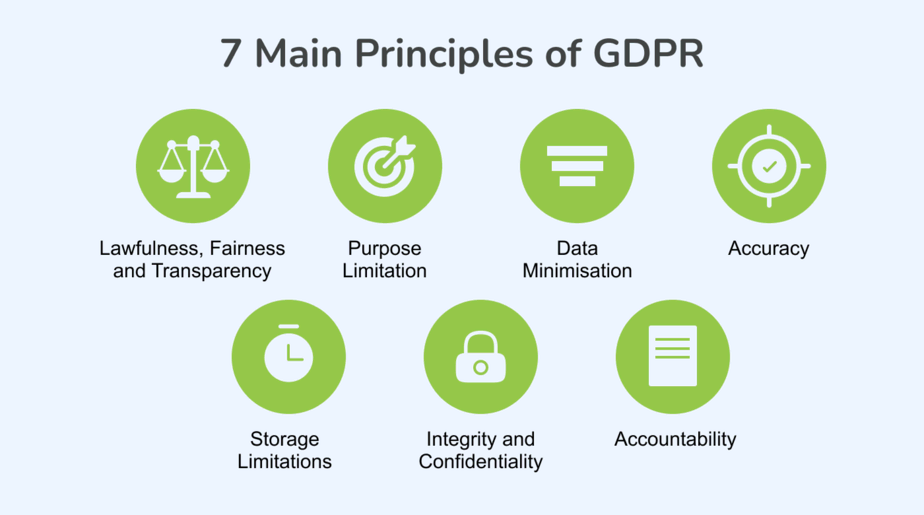

# Basic Data Protection Concepts

## Definition and Importance of Data Protection

Data protection encompasses the practices, regulations, and technologies implemented to secure personal data against unauthorized access, disclosure, alteration, or destruction. **Personal data** includes any information related to an identified or identifiable natural person.

Here are some examples provided by the [European Commission](https://ec.europa.eu/info/law/law-topic/data-protection/reform/what-personal-data_en):

- Name and surname
- Home address
- Email address
- Identification card number
- Location data
- IP addresses
- A Cookie ID
- The advertising identifier on a mobile phone
- Data held by a doctor or hospital including symbols that uniquely identify a person

It ensures confidentiality by making certain that personal information is accessible only to authorized individuals, thereby preserving the privacy of individuals. Additionally, it provides security by protecting data against cyberattacks, leaks, and misuse, thus preventing negative consequences such as identity theft or fraud. Compliance with laws and regulations, such as the General Data Protection Regulation (GDPR) in Europe, is also essential to avoid legal sanctions and maintain the organization's reputation.

## Fundamental Principles of Personal Data Protection

At the core of the GDPR are seven key principles, outlined in [Article 5](https://gdpr-info.eu/art-5-gdpr/) of the legislation, which primarily focus on **protecting individuals' personal data**. These principles serve as a foundational framework, not strict rules, guiding how **personal data** should be handled to ensure privacy, security, and transparency. The GDPR, composed of **99 articles**, is designed to strengthen and unify data protection across the European Union, with a particular emphasis on giving individuals control over their personal data.

The history of the GDPR can be traced back to the **Data Protection Directive 95/46/EC**, which was adopted in 1995. As digital technologies evolved and data processing became more widespread, the need for stronger and more harmonized regulations grew. In 2012, the European Commission proposed the GDPR to replace the outdated directive. After years of negotiation, the GDPR was formally adopted in **April 2016** and became enforceable on **May 25, 2018**.

The GDPR represents a significant evolution in data protection law, modernizing the legal framework to address the challenges of a digital age, with the goal of protecting the rights of individuals and ensuring accountability from organizations that process personal data. This new regulation reflects the growing importance of privacy as a fundamental right in an increasingly interconnected world. While many of the principles are rooted in previous laws, the GDPR amplifies them, with stricter enforcement mechanisms, including hefty fines for non-compliance.

The fundamental principles of data protection, often inspired by the GDPR, include **lawfulness**, **fairness**, and **transparency**, which require that data be processed in a lawful, fair, and transparent manner toward the individuals concerned. This involves informing individuals about how and why their data is being used. However, failing to inform individuals, such as secretly tracking their location or browsing habits, would directly violate transparency and fairness, as individuals would not know how their data is being used.

**Purpose limitation** dictates that data must be collected for specific, explicit, and legitimate purposes, and not processed in a way that is incompatible with those initial purposes. For instance, if data collected for a specific purpose, like an email subscription, is later used for unrelated marketing activities or sold to third parties, it would breach this principle by extending beyond the original intent.

**Data minimization** requires that the data collected be adequate, relevant, and limited to what is necessary to achieve the purposes for which it is processed. Yet, some companies may contradict this by collecting excessive data, such as requesting sensitive personal details (e.g., social security numbers) for a simple newsletter signup, which would go beyond what is necessary.

**Accuracy** mandates that data be accurate and, where necessary, kept up to date, with reasonable measures in place to correct or delete inaccurate data. Nevertheless, if an organization fails to update a user’s contact information after a change request or retains outdated records, it would breach this principle by maintaining inaccurate or misleading data.

**Storage limitation** ensures that data is not kept longer than necessary for the purposes for which it is processed, with appropriate retention periods clearly defined. A company that stores personal data indefinitely, even after the individual has stopped using the service or withdrawn consent, would be violating this principle by unnecessarily prolonging data retention.

**Integrity and confidentiality** require that data be processed securely, ensuring protection against unauthorized access, accidental loss, or damage. In contrast, if an organization stores personal data in an unencrypted format on insecure servers, or lacks proper access controls, it would undermine both the integrity and confidentiality of the data, putting it at significant risk.

Finally, **accountability** was introduced under the GDPR to ensure organizations can demonstrate compliance with the regulation. This includes documenting how personal data is handled and taking steps to ensure only authorized individuals have access. However, an organization that does not maintain proper documentation, fails to train staff on data protection, or cannot prove its compliance would clearly fall short of its accountability obligations.

## Importance of Privacy by Design and Privacy by Default

### Privacy by Design

**Privacy-by-Design** is an approach that helps organisations manage and avoid privacy risks by addressing data privacy issues from the very beginning. This means considering privacy at the design stage of any system, service, product, or process, and continuing to focus on privacy throughout its entire lifecycle. However, failing to consider privacy from the outset and only addressing it after a system is already in place, such as retrofitting security measures following a data breach, directly contradicts this principle, as privacy safeguards should be built into the system, not added as an afterthought.

Organisations should incorporate technical and organisational measures that match the nature of the data processing involved. These measures are designed to identify and mitigate privacy risks, implement data protection principles, and protect individuals' rights. For example, if a company launches a new online platform without implementing encryption for user data from the start, and only later adds it after realizing there is a risk, it would undermine the Privacy-by-Design principle by prioritizing privacy too late in the process. The key idea is to integrate privacy safeguards organically into all activities and processing, rather than as a reactive measure in response to incidents.

To comply with the privacy-by-design framework, organisations can use data-oriented or process-oriented strategies. Data-oriented strategies focus on the technical aspects of data processing. This includes minimising data processing wherever possible, limiting the detail in which personal data is processed, and encrypting data to prevent unauthorized access.

Process-oriented strategies, on the other hand, focus on the procedures involved in data processing. These strategies include informing data subjects about the processing of their personal data in a timely and transparent way, providing individuals with control over how their data is processed, and committing to privacy-oriented data processing practices.

To successfully implement Privacy-by-Design, organisations should at a minimum:

- Conduct a privacy risk assessment.
- Ensure appropriate security controls (like pseudonymisation and encryption) based on the nature of the personal data and the risks posed to individuals’ rights.
- Provide clear and comprehensive information to data subjects about the processing of their personal data and facilitate the exercise of their rights.
- Minimise the processing of personal data and ensure that it only occurs based on lawful grounds.
- Implement strict internal and external access controls in line with applicable privacy laws.

### Privacy by Default

Privacy-by-Default requires organisations to adopt the most stringent privacy settings by default, ensuring that only necessary data processing occurs for specified, lawful purposes. This principle aims at data minimisation, meaning that only the relevant, adequate, and necessary data for a specific processing purpose is collected and processed. Data subjects must be adequately informed about this processing from the start.

To comply with Privacy-by-Default, organisations should follow the principle of ‘purpose limitation.’ This means collecting and processing only the data that is necessary for specified, explicit, and legitimate purposes, and not using it for anything beyond these purposes.

For example, on a social media platform, a user's profile might be set to private by default, limiting its accessibility to others.

To implement Privacy-by-Default successfully, organisations should at a minimum:

- Enable the strictest privacy options by default, such as requiring opt-in consent with unchecked boxes.
- Avoid processing any additional data without the user's consent or another lawful basis.
- Set reasonable and proportionate data retention periods based on the purposes of the processing.
- Automatically delete or anonymise personal data once the processing purpose is fulfilled.
- Provide users with sufficient control and transparency regarding data processing activities, presenting clear and comprehensive information.
- Avoid using dark patterns when obtaining user consent, such as making “accept” buttons more visually prominent than “reject” ones or providing misleading information.
- Refrain from using cookie walls or making access to services conditional on accepting data processing or cookies.
- Ensure that personal data is not automatically made publicly available.

The importance of these concepts lies in several critical aspects. By integrating data protection from the start, the **risks of data breaches are significantly reduced**, which helps prevent security incidents before they occur. These concepts also facilitate compliance with regulations like the GDPR, which require data protection measures to be implemented from the design stage.

Furthermore, users are more likely to trust services that show a strong commitment to protecting their data from the outset, strengthening the relationship between the organization and its clients. These concepts are essential for any organization seeking to manage personal data responsibly and in compliance with applicable regulations, while minimizing risks and enhancing user trust.

## Resources

- [What is Data Protection](https://www.proofpoint.com/fr/threat-reference/data-protection)
- [Privacy by design & Privacy by default](https://www.wearenestor.com/blog/privacy-by-design-et-privacy-by-default#:~:text=Le%20Privacy%20by%20Design%20est,les%20donn%C3%A9es%20n%C3%A9cessaires%20par%20d%C3%A9faut.)
